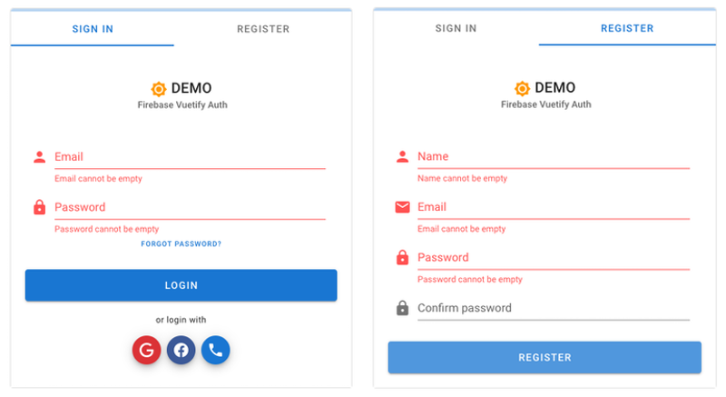

# Firebase Vuetify Auth

Firebase Vuetify Auth is a package providing user authentication against Firebase auth API for VUE application using Vuetify Material Design layout.

## Functionality:

- User authentication - app Sign In
- User registration - app Register
- Email verification for new accounts (required to gain access to the app)
- 3rd party authentication provider integration (Google, Facebook, Phone text message)



## Requirements

Current master branch supports Vue 3 application. For Vue 2 please see vue2 branch.

This package assumes your VUE project is already integrated with Firebase & Vuetify. Example integration:

The Firebase config file, example: `./src/middleware/firebase` is created to initiate Firebase Modular v9 SDK

example:

```javascript
import { initializeApp } from "firebase/app"

const config = {
  appId: process.env.VITE_APP_FIREBASE_APP_ID,
  apiKey: process.env.VITE_APP_FIREBASE_APIKEY,
  authDomain: process.env.VITE_APP_FIREBASE_AUTH,
  databaseURL: process.env.VITE_APP_FIREBASE_DATABASE,
  projectId: process.env.VITE_APP_FIREBASE_PROJECT,
  storageBucket: process.env.VITE_APP_FIREBASE_STORAGE,
  messagingSenderId: process.env.VITE_APP_FIREBASE_MESSAGING,
  measurementId: process.env.VITE_APP_FIREBASE_MEASUREMENT_ID,
}

const app = initializeApp(config)

export default app
```

Additionally, please ensure that you have installed the mdi/fonts package.

example of integration:

```javascript
import "@mdi/font/css/materialdesignicons.css"
```

add this into your vuetify.js

## Install

```bash
npm i @nerd305/firebase-vuetify-auth
```

## Setup

#### STEP 1: Update your `main.js` app file

This example assumes that you're using `vue-router` and `pinia` packages with your app, so we initialize VUE class by passing in `router`, `store` & `vuetify` objects.

```javascript
import { createApp } from "vue"
import { createPinia } from "pinia"

import App from "@/App"
import router from "@/router"
import vuetify from "@/plugins/vuetify"
import AuthGuard from "@nerd305/firebase-vuetify-auth"

import firebase from "@/middleware/firebase"
import { getAuth } from "firebase/auth"

const authGuardSettings = {
  debug: true, // enable debug messages in console log
  session: "local", // session persistance

  router, // routes
  firebase, // pass on firebase middleware app init

  saml: false, // allow authentication with SAML
  saml_text: "Login with OKTA", // text for large login button
  saml_provider_id: "saml.okta", // firebase provider ID for SAML

  email: true, // allow authentication with email
  phone: false, // allow authentication with phone
  google: true, // allow authentication with gmail account
  facebook: false, // allow authentication with facebook account

  verification: false, // require user email to be verified before granting access
  registration: true, // allow new user registrations
}

// reload VUE app on Firebase auth state change
const app = createApp(App)

app.config.productionTip = false

app.use(createPinia())
app.use(router)
app.use(vuetify)
app.use(AuthGuard, authGuardSettings)
app.mount("#app")
```

#### STEP 2: Add AuthenticationGuard to your App.vue template

Update your `App.vue` to include global `AuthGuard` component.

This component will monitor Firebase user auth state and open a fullscreen modal dialog with login screen if user is not autthenticated.

```html
    [ ... ]
    <AuthenticationGuard />
  </v-app>
</template>
```

#### STEP 3: Update vue router to protect desired routes

Example of `router.js` implementation.

```js
import { createWebHistory, createRouter } from "vue-router"

const router = createRouter({
  history: createWebHistory(),
  routes: [
    {
      name: "Home",
      path: "/",
      component: () => import("@/views/HomePage.vue"),
      meta: { requiresAuth: true },
    },
    {
      name: "Public",
      path: "/public",
      component: () => import("@/views/PublicRoute.vue"),
    },
    {
      name: "Protected",
      path: "/protected",
      meta: { requiresAuth: true },
      component: () => import("@/views/ProtectedRoute.vue"),
    },
  ],
})

router.beforeEach(guard)

export default router
```

add `meta: { requiresAuth: true }` for any route that would require authentication.

### That's it!

After following implementation instruction requests to protected views, should render a login / registration view, unless user is already logged into the application.

For more usage examples (how to log in/sign out and so on) please check the package source code

## Available settings

| Prop         | Type             | Default                                       | Description                                                                                                    |
| ------------ | ---------------- | --------------------------------------------- | -------------------------------------------------------------------------------------------------------------- |
| router       | Object           | null                                          | VUE router                                                                                                     |
| firebase     | Object           | null                                          | Firebase middleware - initialized app                                                                          |
| session      | String           | "local"                                       | Firebase auth state session persistence, see: https://firebase.google.com/docs/auth/web/auth-state-persistence |
| verification | Boolean or array | true                                          | require email verification to sign in for all accounts or for specific domains in array                        |
| registration | Boolean          | true                                          | allow new user registrations                                                                                   |
| phone        | Boolean          | true                                          | allow users to singin using phone number                                                                       |
| google       | Boolean          | true                                          | allow users to singin using gmail                                                                              |
| facebook     | Boolean          | true                                          | allow users to singin using facebook                                                                           |
| title        | String           | "Authenticate"                                | authentication prompt title                                                                                    |
| subtitle     | String           | "Firebase Vuetify Authentication NPM package" | authentication prompt subtitle                                                                                 |
| icon         | String           | "mdi-brightness-7"                            | authentication prompt icon                                                                                     |
| iconColor    | String           | "orange"                                      | authentication prompt icon                                                                                     |
