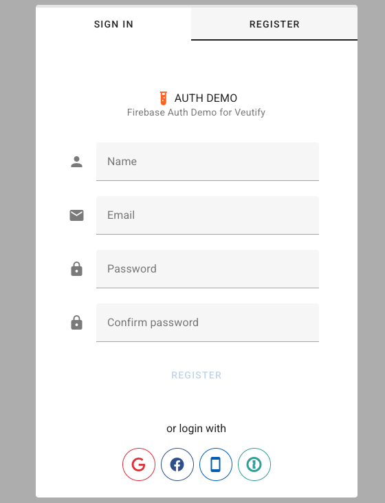
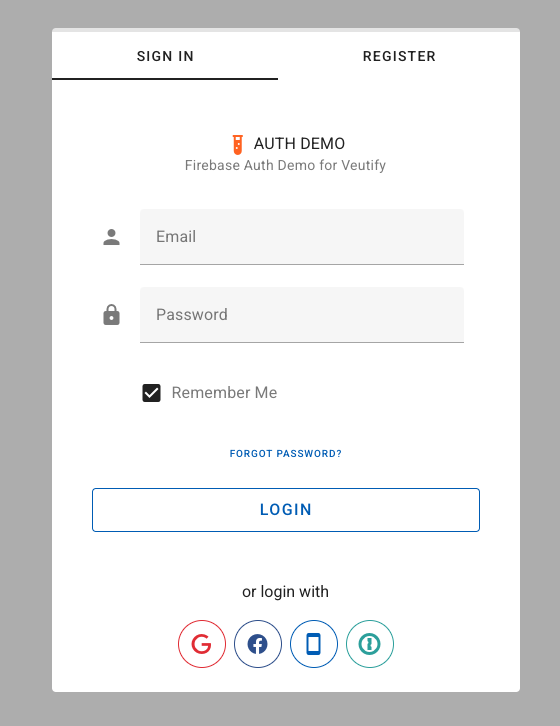

# Firebase Vuetify Auth - Vue 3 & Vuetify 3

**Accelerate your Vue 3 and Vuetify 3 application development with a ready-to-use Firebase authentication solution.**

`@nerd305/firebase-vuetify-auth` provides a seamless integration of Firebase Authentication with beautiful Vuetify 3 components. This package is designed to save you significant development time by offering pre-built UI and logic for common authentication flows, allowing you to focus on your application's core features.

If you're building a Vue 3 application with Vuetify 3 and need robust user authentication without the boilerplate, this package is for you. Get your users signing in, registering, and managing their accounts quickly and easily.

## Core Benefits

*   **Rapid Integration:** Drop in a complete authentication system in minutes.
*   **Time-Saving:** Avoid building common authentication UI and logic from scratch.
*   **Vuetify 3 Native:** Components are built with Vuetify 3, ensuring a consistent look and feel with your application.
*   **Firebase Powered:** Leverages the security and scalability of Firebase Authentication.
*   **Feature-Rich:** Supports email/password, social logins (Google, Facebook), phone authentication, SAML, and email verification.
*   **Customizable:** Configure various authentication methods and UI aspects to suit your needs.

## Functionality: Speeding Up Your Auth Implementation

This package provides out-of-the-box solutions for:

-   **User Sign-In:** A ready-to-use, Vuetify-styled login form.
-   **User Registration:** Secure new user account creation.
-   **Email Verification:** Optional, configurable email verification flow to ensure valid user emails.
-   **Password Reset:** "Forgot Password" functionality.
-   **Third-Party Logins:** Easy integration for:
    -   Google Sign-In
    -   Facebook Sign-In
    -   Phone Number (Text Message/SMS) Authentication
    -   SAML-based Single Sign-On (SSO)
-   **Route Protection:** Middleware to easily protect your application's routes.
-   **Reactive State Management:** Built with Pinia for a clear and maintainable auth state.




## Requirements

Current master branch supports Vue 3 application. For Vue 2 please see vue2 branch.

**Note:** This package is compatible only with Pinia versions 3 and above.

This package assumes your Vue 3 project already has:
- Firebase initialized (`firebase/app`)
- Vuetify 3 installed and configured
- Vue Router installed
- Pinia installed
- `@mdi/font` installed (import `@mdi/font/css/materialdesignicons.css` in your Vuetify setup)

## Install

```bash
npm i @nerd305/firebase-vuetify-auth
```

## Setup

Integrating `@nerd305/firebase-vuetify-auth` into your Vue 3 and Vuetify 3 project requires four essential steps:

*   **STEP 1:** Create an auth plugin configuration file
*   **STEP 2:** Register the plugin in your `main.ts`
*   **STEP 3:** Add the `<AuthenticationGuard />` component to your `App.vue`
*   **STEP 4:** Configure Vue Router with `AuthMiddleware` for route protection

#### STEP 1: Create auth plugin configuration

Create a plugin file that initializes the auth guard with your Firebase app instance and desired settings.

```typescript
// src/plugins/auth.ts
import router from "@/router"
import AuthGuard from "@nerd305/firebase-vuetify-auth"
import type { FirebaseApp } from "firebase/app"

// Import your Firebase app instance (however you initialize it)
import { app as firebaseApp } from "@/middleware/firebase"

const authGuardSettings = {
  router,
  firebase: firebaseApp,    // Your initialized Firebase app instance
  google: true,              // Enable Google sign-in
  email: false,              // Disable email/password sign-in
  verification: false,       // Require email verification
  registration: false,       // Allow new user registration
  title: "My App",
  subtitle: "Welcome",
  icon: "mdi-lock",
  iconColor: "primary",
}

export { AuthGuard, authGuardSettings }
```

> See the full [Available Settings](#available-settings) table for all configuration options.

#### STEP 2: Register the plugin in `main.ts`

```typescript
// src/main.ts
import { createApp } from "vue"
import { createPinia } from "pinia"
import App from "./App.vue"
import router from "./router"
import vuetify from "./plugins/vuetify"
import { AuthGuard, authGuardSettings } from "./plugins/auth"

const app = createApp(App)

app.use(createPinia())
app.use(router)
app.use(vuetify)
app.use(AuthGuard, authGuardSettings)
app.mount("#app")
```

#### STEP 3: Add AuthenticationGuard to your `App.vue`

The `<AuthenticationGuard />` component is globally registered by the plugin. Add it to your `App.vue` and use `isAuthenticated` from the auth store to gate your application content:

```vue
<!-- App.vue -->
<template>
  <v-app>
    <!-- App chrome: only show when authenticated -->
    <app-bar v-if="isAuthenticated" />
    <app-navigation v-if="isAuthenticated" />

    <v-main>
      <!-- Protected content: only render when authenticated -->
      <router-view v-if="isAuthenticated" />

      <!-- Auth dialog: shows login UI when needed -->
      <AuthenticationGuard />
    </v-main>

    <!-- Required for phone authentication if enabled -->
    <!-- <div id="recaptcha-container"></div> -->
  </v-app>
</template>

<script setup lang="ts">
import { storeToRefs } from "pinia"
import { useAuthStore } from "@nerd305/firebase-vuetify-auth"

const authStore = useAuthStore()
const { isAuthenticated } = storeToRefs(authStore)
</script>
```

**Key points:**
- Gate your app content (nav, router-view) behind `v-if="isAuthenticated"` to prevent flash of protected content
- `<AuthenticationGuard />` renders a fullscreen modal dialog when authentication is required
- Use `storeToRefs` to get reactive access to store getters like `isAuthenticated`

#### STEP 4: Configure Vue Router with AuthMiddleware

Import `AuthMiddleware` from the package and apply it as a global navigation guard. Mark protected routes with `meta: { requiresAuth: true }`.

```typescript
// src/router/index.ts
import { createWebHistory, createRouter } from "vue-router"
import { AuthMiddleware } from "@nerd305/firebase-vuetify-auth"

const routes = [
  {
    path: "/",
    name: "Home",
    component: () => import("@/views/HomeView.vue"),
    meta: { requiresAuth: true },
  },
  {
    path: "/public",
    name: "Public",
    component: () => import("@/views/PublicView.vue"),
    // No requiresAuth — this route is public
  },
]

const router = createRouter({
  history: createWebHistory(),
  routes,
})

// Apply auth guard globally
router.beforeEach(AuthMiddleware)

export default router
```

**Important:** Only routes with `meta: { requiresAuth: true }` are protected. Routes without this meta property are public and will never trigger the authentication dialog.

### Secure Navigation Behavior

This package implements secure navigation blocking to prevent protected content from being displayed before authentication:

- **Navigation Blocking**: When an unauthenticated user attempts to access a protected route, the navigation is completely blocked (`next(false)`). The user remains on their current route and the authentication dialog appears.
- **No Content Exposure**: Protected route components are never rendered or mounted when the user is not authenticated. This ensures sensitive content cannot be seen, even momentarily, before the authentication dialog appears.
- **Post-Authentication Redirect**: After successful authentication, users are automatically redirected to the route they originally attempted to access.
- **Clean User Experience**: The browser URL does not change to the protected route until authentication is successful, providing a cleaner and more secure experience.

### Using the Auth Store

Access authentication state and user data in any component via the Pinia store:

```vue
<script setup lang="ts">
import { storeToRefs } from "pinia"
import { useAuthStore } from "@nerd305/firebase-vuetify-auth"

const authStore = useAuthStore()
const { isAuthenticated, current_user } = storeToRefs(authStore)

// Sign out
const handleSignOut = () => authStore.signOut()
</script>

<template>
  <div v-if="isAuthenticated">
    <p>Welcome, {{ current_user?.displayName || current_user?.email }}</p>
    <v-btn @click="handleSignOut">Sign Out</v-btn>
  </div>
</template>
```

### Available Store Getters

| Getter | Type | Description |
|--------|------|-------------|
| `isAuthenticated` | `boolean` | Whether the user is currently signed in |
| `isReady` | `boolean` | Whether the auth state has been initialized |
| `current_user` | `object \| null` | Current Firebase user object |
| `uid` | `string \| null` | Current user's UID |
| `email` | `string \| null` | Current user's email |
| `displayName` | `string \| null` | Current user's display name |
| `photoURL` | `string \| null` | Current user's photo URL |
| `emailVerified` | `boolean` | Whether the user's email is verified |
| `is_loading` | `boolean` | Whether an auth operation is in progress |
| `getError` | `object \| null` | Last authentication error |

### Available Store Methods

| Method | Description |
|--------|-------------|
| `signOut()` | Sign out the current user |
| `loginWithEmail(email, password, rememberMe)` | Sign in with email/password |
| `registerUser(displayName, email, password)` | Register a new user |
| `loginWithGoogle()` | Sign in with Google |
| `loginWithFacebook()` | Sign in with Facebook |
| `emailPasswordResetLink(email)` | Send password reset email |
| `toggleAuthDialog(value?)` | Programmatically show/hide the auth dialog |

### Programmatic Auth Dialog Control

You can trigger the authentication dialog programmatically from any component:

```typescript
import { useAuthStore } from "@nerd305/firebase-vuetify-auth"

const authStore = useAuthStore()

// Show the login dialog
authStore.toggleAuthDialog(true)

// Or set directly
authStore.is_authguard_dialog_shown = true
```

### Protecting Route Content with AuthRouterView

When a user signs out while on a protected route, you may want to show fallback content while keeping the URL intact. The package provides an `AuthRouterView` component:

```vue
<template>
  <v-app>
    <AppHeader />
    <!-- Use instead of <router-view /> -->
    <AuthRouterView fallback-route="/" />
    <AppFooter />
  </v-app>
</template>

<script setup>
import { AuthRouterView } from '@nerd305/firebase-vuetify-auth'
</script>
```

The `AuthRouterView` component:
- Shows the actual route component when authenticated
- Shows fallback route content when unauthenticated on a protected route
- Keeps the URL unchanged
- Automatically switches back when user signs in

**Props:**
- `fallback-route` (optional): The route path for fallback content. Defaults to `'/'`

### Integration Checklist

- [ ] **Auth plugin file created** (`src/plugins/auth.ts`) with Firebase app instance and settings
- [ ] **Plugin registered in `main.ts`** — `app.use(AuthGuard, authGuardSettings)`
- [ ] **`<AuthenticationGuard />` added to `App.vue`** inside `<v-app>`
- [ ] **`AuthMiddleware` applied to router** — `router.beforeEach(AuthMiddleware)`
- [ ] **Protected routes marked** with `meta: { requiresAuth: true }`

**Common Integration Issues:**
1. **Missing `<AuthenticationGuard />`** — The auth dialog won't appear
2. **Missing `AuthMiddleware`** — Routes won't be protected
3. **Content flash** — Gate `<router-view>` behind `v-if="isAuthenticated"` to prevent flash of protected content before auth state resolves
4. **Wrong component placement** — Place `<AuthenticationGuard />` at the same level as `<router-view />`

### Authentication Methods (Popup vs Redirect)

The package supports both popup and redirect authentication flows for OAuth providers (Google, Facebook, SAML):

**Popup Method:**
- Opens authentication in a popup window
- Better for desktop browsers
- May be blocked by popup blockers
- Provides immediate feedback

**Redirect Method:**
- Redirects the entire page to the auth provider
- Better for mobile devices
- Requires additional setup for modern browsers (Chrome 115+, Firefox 109+, Safari 16.1+)
- See [Firebase's redirect best practices](https://firebase.google.com/docs/auth/web/redirect-best-practices) for setup

**Auto Mode (Default):**
- Automatically selects popup for desktop and redirect for mobile
- Provides the best user experience across devices
- Falls back to the opposite method if the primary fails (configurable)

## How It Works

This section provides an overview of the internal mechanism of the `firebase-vuetify-auth` package.

### 1. Plugin Initialization (`src/wrapper.ts`)
When you install the plugin using `app.use(AuthGuard, authGuardSettings)`:
- The `authGuardSettings` are merged with default settings and stored in the Pinia store (`useAuthStore`).
- Firebase Authentication is initialized (`getAuth`).
- The **default session persistence** (e.g., "local", "browser") is set on the Firebase `auth` object based on the `session` property in `authGuardSettings`. This default applies to all sign-in methods unless overridden (e.g., by the "Remember me" checkbox for email/password).
- An `onAuthStateChanged` listener is attached to Firebase. This listener is crucial for reacting to changes in the user's authentication state.

### 2. Core UI Component: `<AuthenticationGuard />` (`src/components/AuthGuard.vue`)
- This component should be added to your main `App.vue`.
- It renders the main authentication dialog (`v-dialog`).
- The visibility of this dialog (`is_authguard_dialog_shown` state in Pinia) is controlled by the authentication logic.
- The dialog contains tabs for Sign In, Register, Reset Password, and also houses the Email Verification screen.
- Its internal state (like active tab) and the display of different forms (login, register, phone, email verification) are managed by the Pinia store.

### 3. State Management (Pinia - `useAuthStore`)
A dedicated Pinia store (`useAuthStore`) is the central hub for authentication-related state:
- **`config`**: Stores the `authGuardSettings` provided during initialization.
- **`current_user`**: Holds the Firebase user object when a user is authenticated.
- **`is_loading`**, **`error`**: Manage loading states for asynchronous operations (like login attempts) and store any errors that occur.
- **UI States**:
    - `is_authguard_dialog_shown`: Boolean, controls the visibility of the main authentication dialog.
    - `is_authguard_dialog_persistent`: Boolean, determines if the dialog can be closed by clicking outside or pressing Escape.
    - `is_email_verification_screen_shown`: Boolean, controls the visibility of the email verification prompt.
    - `tab`: Number, manages the active tab within the authentication dialog (Sign In, Register, Reset Password).
    - Other states related to phone login steps, password reset confirmation, etc.
- **Actions**:
    - Functions like `loginWithEmail`, `registerUser`, `signOut`, `loginWithGoogle`, etc.
    - These actions typically call the corresponding Firebase SDK methods to perform authentication operations.
    - They update `is_loading` and `error` states and, upon success, Firebase's `onAuthStateChanged` listener (see below) will update the `current_user`.

### 4. Firebase `onAuthStateChanged` Listener
- Set up in `src/wrapper.ts`.
- This listener fires whenever a user signs in or out of Firebase.
- **Primary Action**: It updates the `authStore.current_user` with the new Firebase user object (or `null` if signed out).
- **Triggers `authcheck()`**: After updating the user state, it calls the `authcheck()` function (see below) to re-evaluate route access permissions and dialog visibility based on the new authentication status.
- **Email Verification Check**: If a user is authenticated but their email is not verified (and email verification is required by the configuration), this listener also sets up an interval to periodically reload the user's Firebase profile to check if their email has been verified. If verification occurs, the page is reloaded.

### 5. Routing and Navigation Guard (`AuthMiddleware` from `src/components/authguard.ts`)
- This middleware is intended to be registered globally with Vue Router using `router.beforeEach(AuthMiddleware)`.
- **On Each Navigation**:
    - It inspects the target route (`to`) to see if it requires authentication (via `to.meta.requiresAuth: true`).
    - It determines if the navigation is from a public route to a protected route.
    - It updates two key states in the Pinia store:
        - `is_route_public`: Set to `true` if the target route does not require authentication, `false` otherwise.
        - `is_from_public_to_auth`: Set to `true` if navigating from a public page to a protected one, `false` otherwise. This influences dialog persistence.
    - **Calls `authcheck()`**: After updating these store states, it calls the `authcheck()` function to make the final decision on allowing or blocking the navigation.

### 6. Core Logic Decider (`authcheck.ts` from `src/components/authcheck.ts`)
This function is the heart of the access control and dialog management logic. It is called in two main scenarios:
1.  By the `AuthMiddleware` during every route navigation.
2.  By the `onAuthStateChanged` listener whenever the Firebase authentication state changes.

**`authcheck()` performs the following checks:**
- **Is the route public?** (`store.is_route_public`): If yes, access is allowed, and the auth dialog is hidden.
- **Is the user authenticated?** (checks `firebase.auth().currentUser`):
    - If **not authenticated** and trying to access a protected route:
        - The auth dialog (`is_authguard_dialog_shown`) is shown.
        - If navigating from a public route (`store.is_from_public_to_auth` is true), the dialog is made non-persistent (`is_authguard_dialog_persistent = false`), allowing the user to close it and stay on the public page.
        - Otherwise (e.g., initial load on a protected route), the dialog is persistent.
        - Navigation is blocked.
    - If **authenticated**:
        - **Email Verification Check**:
            - It checks `currentUser.emailVerified` against the `config.verification` rules (is verification required for all, or for specific domains?).
            - If verification is required and the user's email is not verified:
                - Access to the protected route is blocked.
                - The auth dialog is shown and made persistent.
                - The specific email verification screen is displayed (`is_email_verification_screen_shown = true`).
            - If email is verified, or verification is not required for this user:
                - Access to the protected route is allowed.
                - The auth dialog is hidden.
- **Anonymous Users**: If email verification is active, anonymous users are generally blocked from protected resources that would require a verified email, as they cannot verify an email.
- **Returns**: `true` if navigation/access is allowed, `false` otherwise. The `AuthMiddleware` uses this return value to call `next()` or `next(false)`.

### 7. Email Verification Flow
- If `authGuardSettings.verification` is enabled (either `true` for all or an array of domains):
    - When an authenticated but unverified user (matching the verification rules) attempts to access a protected route, `authcheck()` will:
        - Block access.
        - Show the auth dialog (`is_authguard_dialog_shown = true`).
        - Make the dialog persistent (`is_authguard_dialog_persistent = true`).
        - Display the email verification screen (`is_email_verification_screen_shown = true`) within the dialog. This screen prompts the user to check their email and provides an option to resend the verification email.
    - The `onAuthStateChanged` listener in `src/wrapper.ts` includes logic to periodically reload the user's Firebase profile. If `currentUser.emailVerified` becomes `true`, it reloads the entire page to reflect the verified state and grant access.

### 8. Dialog Persistence
The authentication dialog's persistence (whether it can be closed by clicking outside or pressing Escape) is dynamically managed:
- **Persistent**:
    - Typically when the user initially lands on a protected route and is not authenticated.
    - When email verification is required and the user's email is not yet verified.
- **Non-Persistent (Closable)**:
    - When a user navigates from a public page to a protected page. This allows them to close the dialog and remain on the public page if they choose not to sign in.

This mechanism ensures that users are appropriately prompted for authentication or verification while providing a user-friendly experience for different navigation scenarios.

## Testing Scenarios

For detailed examples of expected behavior under various conditions (user signed off, signed in with unconfirmed email, different verification settings, etc.), please refer to the manual test scenarios outlined in:
[`src/tests/README.md`](./src/tests/README.md)

This document provides a structured way to test the core functionalities and edge cases of the package.

## Phone Authentication (reCAPTCHA)

If you enable phone authentication (`phone: true` in `authGuardSettings`), you must:

1. **Enable Phone Authentication in Firebase Console**:
   - Go to Firebase Console → Authentication → Sign-in method
   - Enable "Phone" as a sign-in provider
   - Add your testing phone numbers if in development

2. **Include reCAPTCHA container**: Add an empty `div` with ID `recaptcha-container` in your main application template:

Example in `App.vue`:
```html
<template>
  <v-app>
    <!-- ... your app layout ... -->

    <!-- This div is used by Firebase for reCAPTCHA. It can be empty. -->
    <div id="recaptcha-container"></div>

    <AuthenticationGuard />
  </v-app>
</template>
```

3. **Common Issues**:
   - If you see "appVerificationDisabledForTesting" error, ensure phone auth is enabled in Firebase Console
   - The reCAPTCHA verifier requires a valid Firebase project with phone authentication enabled
   - In development, add test phone numbers in Firebase Console to bypass SMS verification

## Security Note

This package facilitates client-side authentication flows with Firebase. **It is crucial to understand that client-side code, including Firebase API keys and configuration, is publicly accessible.**

**True security for your application's data and backend resources must be enforced through Firebase Security Rules** (for Firestore, Realtime Database, and Cloud Storage) and by correctly configuring your Firebase Authentication providers in the Firebase console. This package helps manage the user's authentication state on the client but does not, by itself, secure your backend. Always ensure your Firebase Security Rules are robust and properly tested.

## Troubleshooting

### Authentication Dialog Shows a Loading State
During initial page load or after a page refresh, you may briefly see a loading state in the authentication dialog. This is normal behavior as the package waits for Firebase to restore the authentication state. The loading state ensures that:
- Previously authenticated users are not incorrectly shown the login form
- The authentication state is fully initialized before making navigation decisions
- Firebase has time to check for redirect results from OAuth providers

### Protected Routes and Direct URL Access
When accessing a protected route directly (e.g., by entering the URL in the browser):
- If authenticated: The route loads immediately
- If not authenticated: Navigation is blocked, and the authentication dialog appears as a persistent modal
- After successful authentication: You are automatically redirected to the originally requested route

### That's it!

After following implementation instruction requests to protected views, should render a login / registration view, unless user is already logged into the application.

For more usage examples (how to log in/sign out and so on) please check the package source code

## Demo Application

The included demo application (`npm run dev`) features an interactive settings panel that allows you to:
- Toggle authentication providers (Email, Phone, Google, Facebook, SAML) on/off
- Enable/disable user registration
- Toggle email verification requirements
- See real-time which providers are active
- All settings are persisted in localStorage

This makes it easy to test different authentication configurations without modifying code. Simply toggle the settings you want to test and refresh the page to apply the changes.

## Available Settings

| Prop         | Type             | Default                                       | Description                                                                                                                               |
| ------------ | ---------------- | --------------------------------------------- | ----------------------------------------------------------------------------------------------------------------------------------------- |
| `router`       | Vue Router Instance | `null`                                        | **Required.** Your Vue Router instance.                                                                                                     |
| `firebase`     | Firebase App Instance | `null`                                        | **Required.** Your initialized Firebase app instance (from `initializeApp()`).                                                            |
| `session`      | String           | `"local"`                                     | Default Firebase auth state session persistence for all auth methods. Options: `"local"`, `"browser"` (or `"session"`), `"none"`. The "Remember me" checkbox for email/password login overrides this for that specific login. See [Firebase Docs](https://firebase.google.com/docs/auth/web/auth-state-persistence). |
| `verification` | Boolean or Array | `false`                                       | Requires email verification. `true` for all new accounts, or an array of specific email domains (e.g., `['yourdomain.com']`) to target. |
| `registration` | Boolean          | `true`                                        | `true` to allow new user registrations through the UI, `false` to disable.                                                                |
| `debug`        | Boolean          | `false`                                       | `true` to enable verbose console logging from the package, `false` to disable.                                                            |
| `email`        | Boolean          | `true`                                        | `true` to enable email/password authentication method.                                                                                    |
| `phone`        | Boolean          | `false`                                       | `true` to enable phone number authentication method. (Requires reCAPTCHA setup, see above).                                               |
| `google`       | Boolean          | `true`                                        | `true` to enable Google Sign-In authentication method.                                                                                    |
| `facebook`     | Boolean          | `false`                                       | `true` to enable Facebook Sign-In authentication method.                                                                                  |
| `saml`         | Boolean          | `false`                                       | `true` to enable SAML-based authentication.                                                                                               |
| `saml_text`    | String           | `"Login with OKTA"`                           | Custom text for the SAML login button (if `saml` is `true` and it's the only 3rd party provider).                                         |
| `saml_provider_id` | String       | `"saml.okta"`                                 | Your Firebase SAML Provider ID (e.g., `"saml.myprovider"`) (if `saml` is `true`).                                                          |
| `title`        | String           | `"Authenticate"`                                | Title displayed on the authentication dialog.                                                                                           |
| `subtitle`     | String           | `"Firebase Vuetify Authentication NPM package"` | Subtitle displayed on the authentication dialog.                                                                                        |
| `icon`         | String           | `"mdi-brightness-7"`                            | MDI icon class for the icon displayed on the authentication dialog.                                                                       |
| `iconColor`    | String           | `"orange"`                                      | Color of the icon on the authentication dialog.                                                                                           |
